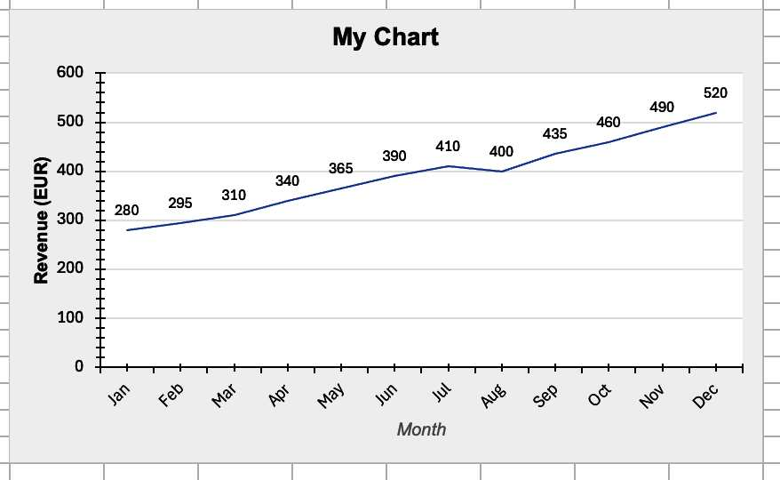
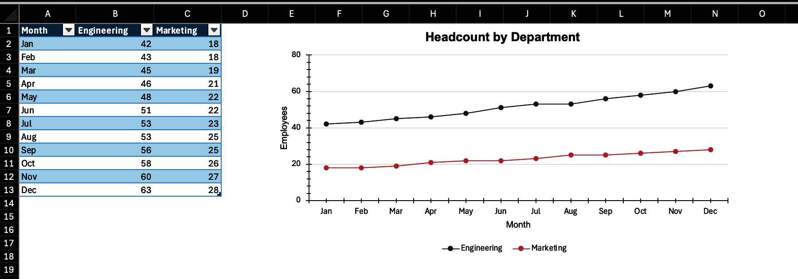
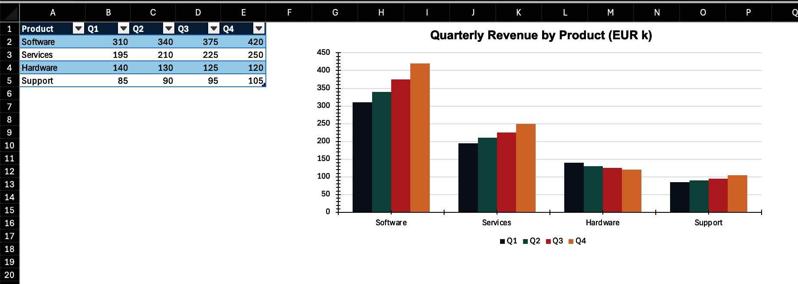
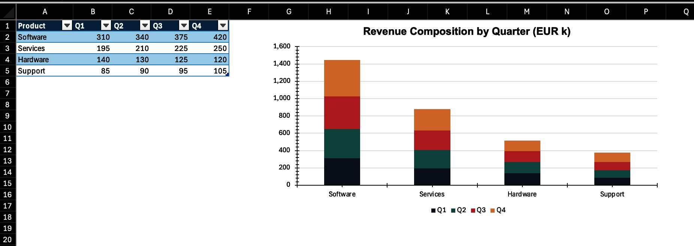
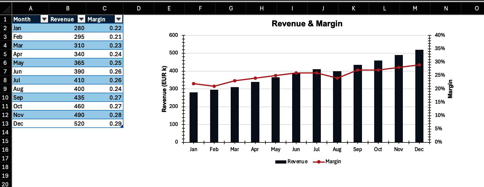
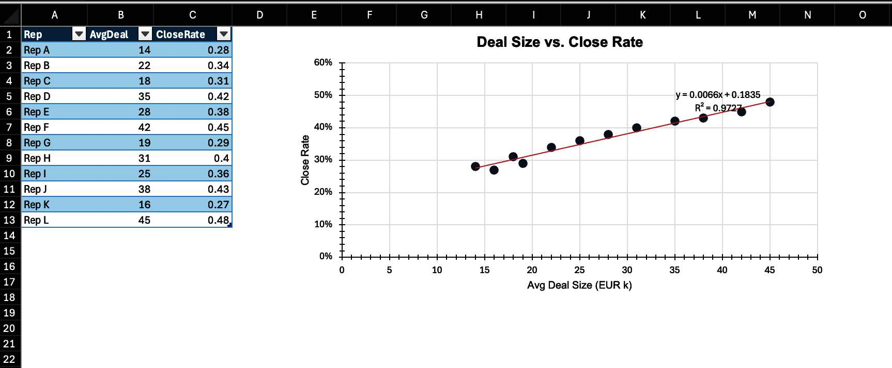
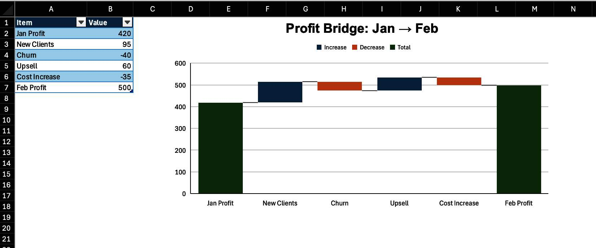
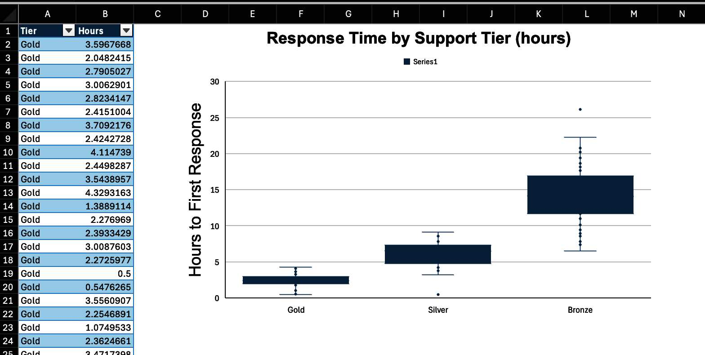

# encharter

<!-- badges: start -->

[](https://github.com/JanMarvin/encharter/actions/workflows/check-standard.yaml)
[](https://app.codecov.io/gh/JanMarvin/encharter)
[](https://janmarvin.r-universe.dev/encharter)
<!-- badges: end -->

> Experimental package that is still in development.

`encharter` is the charting companion to
[`openxlsx2`](https://janmarvin.github.io/openxlsx2/). It is treated as
a first-class citizen there: `wb_add_encharter()` lives directly in
`openxlsx2`, and `encharter` integrates with `openxlsx2`’s own helper
functions —
[`wb_color()`](https://janmarvin.github.io/openxlsx2/reference/wb_color.html)
for colors and
[`fmt_txt()`](https://janmarvin.github.io/openxlsx2/reference/fmt_txt.html)
for rich-text formatting — wherever those make sense in a chart context.

The package covers both the standard OOXML chart types (bar, line,
scatter, pie, …) and the extended modern types Excel introduced later:
waterfall, treemap, sunburst, box-and-whisker, funnel, and region map.

------------------------------------------------------------------------

## Installation

`encharter` requires `openxlsx2` (\>= 1.26).

``` r
install.packages(
  "encharter",
  repos = c("https://janmarvin.r-universe.dev", "https://cloud.r-project.org")
)
```

Or from GitHub directly:

``` r
remotes::install_github("JanMarvin/encharter")
```

------------------------------------------------------------------------

## How a chart is built

`ec()` (short for `encharter()`) creates an `R6` chart object. You then
call methods on it to add series and configure the chart, and finally
hand it to `wb_add_encharter()`.

``` r
library(openxlsx2)
library(encharter)

df <- data.frame(
  Month = month.abb,
  Sales = c(280, 295, 310, 340, 365, 390, 410, 400, 435, 460, 490, 520)
)

chart <- ec("lineChart")
chart$set_chart_title("Monthly Sales")
chart$add_series(
  name   = "Sales!$B$1",
  label  = "Sales!$A$2:$A$13",
  data   = "Sales!$B$2:$B$13"
)

wb <- wb_workbook() |>
  wb_add_worksheet("Sales") |>
  wb_add_data(x = df) |>
  wb_add_encharter(graph = chart, dims = "D2:K18")
```

Because R6 objects mutate in place, there is no need to reassign after
each method call.

<div class="figure">


<p class="caption">

Fig 1: Our first `encharter` chart
</p>

</div>

### Specifying data ranges

Series data is referenced by cell range strings. There are two ways to
write these.

**By hand**, using standard Excel notation — sheet name, column, and
row, all absolute:

``` r
chart$add_series(
  name   = "Sales!$B$1",
  label  = "Sales!$A$2:$A$13",
  data   = "Sales!$B$2:$B$13"
)
```

**Via `wb_data()`**, which constructs the range strings from a workbook
object that already has data in it. This avoids hardcoding cell
addresses and is less error-prone when the data layout changes:

``` r
dat <- wb_data(wb, sheet = "Sales", dims = "A1:B13")

chart$add_series(
  name   = "Sales",
  label  = "Month",
  data   = dat
)
```

Both approaches produce the same OOXML output. The manual approach is
more explicit and easier to read when the ranges are simple and fixed.
`wb_data()` pays off when building charts programmatically or when the
source range is determined at runtime, and feels more native to R.

There are trade-offs to both. With the range approach it is possible to
assign a custom series name that is not itself a cell reference — in the
`wb_data()` approach the name must correspond to a column in the data
object. Multi-level legends, where Excel groups entries across two rows
(for example, an age group label spanning a male and female series), are
only achievable with the range approach. On the other hand, some
features like drop-down lines require construction with `wb_data()`
objects. The examples below use both approaches interchangeably to show
that they are equivalent; a comment marks each switch.

### `wb_color()` and `fmt_txt()`

Anywhere `encharter` accepts a color string, you can pass a plain
six-digit hex value (`"4472C4"`) or a `wb_color()` object from
`openxlsx2`:

``` r
# chart$add_series(..., color = wb_color("steelblue"))
chart$set_chart_title("Sales", font_color = wb_color(hex = "#CC0000"))
```

Chart titles also accept `fmt_txt()` objects for mixed formatting within
a single title — for example, a word in bold followed by normal text:

``` r
chart$set_chart_title(
  fmt_txt("Monthly ", bold = FALSE) + fmt_txt("Sales", bold = TRUE)
)
```

------------------------------------------------------------------------

## Styling

`encharter` ships with an opinionated set of defaults that produce
clean, neutral charts without any extra configuration. The chart
background is white, the plot area is transparent, vertical grid lines
are off by default, and the legend sits to the right. These defaults are
a deliberate subset of what OOXML allows — enough to cover most cases
without overwhelming the API.

All styling calls are optional and can be mixed into any of the examples
below.

### Titles

``` r
chart$set_chart_title("My Chart", bold = TRUE, font_size = 14, font_color = "222222")
chart$set_x_title("Month", italic = TRUE, font_color = "888888")
chart$set_y_title("Revenue (EUR)", bold = TRUE)
```

### Axes

``` r
# Value axis: fixed range, thousands separator, light grid lines
chart$set_y_axis(
  min        = 0,
  max        = 600,
  major      = 100,
  format     = "#,##0",
  grid_lines = TRUE,
  grid_color = "EEEEEE"
)

# Category axis: angled labels, outward ticks
chart$set_x_axis(
  major_tick = "out",
  rotation   = -45
)
```

### Chart and plot area

``` r
chart$set_chart_style(fill = "F7F7F7", line = "DDDDDD", line_width = 0.5)
chart$set_plot_style(fill = "FFFFFF")
```

### Data labels

``` r
# Global default for all series
# the position is relative to the chart type, while some chart types support
# "t", "b" (e.g., line) others require "outEnd" (bar charts)
chart$set_data_label_style(show_val = TRUE, font_size = 9)

# # Or per series, via add_series()
# chart$add_series(..., show_val = TRUE)
```

### Legend

``` r
# chart$set_legend_style(pos = "bottom", font_size = 9)   # bottom
chart$set_legend_style(pos = "none")                      # hidden
```

``` r
wb <- wb |>
  wb_add_encharter(graph = chart, dims = "D20:K36")

if (interactive()) wb$open()
```

<div class="figure">


<p class="caption">

Fig 2: The initial chart with styling
</p>

</div>

------------------------------------------------------------------------

## Examples

The chunks below build a single workbook. Run them from top to bottom
and save at the end to get `encharter_examples.xlsx` with one sheet per
chart type. Each sheet places the data in the top-left corner and the
chart directly to its right, with some basic table styling applied so
the result looks reasonable when opened.

``` r
# This section can be run standalone. The libraries are loaded again here
# so these chunks work independently of the intro section above.
library(openxlsx2)
library(encharter)

wb <- wb_workbook(creator = "encharter")
```

------------------------------------------------------------------------

### Line chart — trends over time

A line chart is the natural choice when the X axis is a time dimension
and the story is about direction of change rather than individual
values. Here we show monthly headcount across two departments so the
reader can compare trajectories at a glance.

``` r
df_line <- data.frame(
  Month       = month.abb,
  Engineering = c(42, 43, 45, 46, 48, 51, 53, 53, 56, 58, 60, 63),
  Marketing   = c(18, 18, 19, 21, 22, 22, 23, 25, 25, 26, 27, 28)
)

wb <- wb_add_worksheet(wb, "Line", grid_lines = FALSE)
wb <- wb_add_data_table(
  wb, sheet = "Line", x = df_line,
  dims = "A1", table_style = "TableStyleMedium2"
)
wb <- wb_set_col_widths(wb, sheet = "Line", cols = 1:3, widths = c(10, 14, 12))
wb_df <- wb_data(wb)

chart <- ec("lineChart")
chart$set_chart_title("Headcount by Department", bold = TRUE)
chart$set_x_title("Month")
chart$set_y_title("Employees")
chart$set_y_axis(min = 0, max = 80, major = 20, grid_lines = TRUE, grid_color = "EEEEEE")

chart$add_series(
  name   = Engineering,
  label  = Month,
  data   = wb_df,
  color  = "2E4057",
  marker = "circle"
)
chart$add_series(
  name   = Marketing,
  label  = Month,
  data   = wb_df,
  color  = "E84855",
  marker = "circle"
)

chart$set_legend_style(pos = "bottom")

wb <- wb_add_encharter(wb, sheet = "Line", graph = chart, dims = "E1:N18")
```

<div class="figure">


<p class="caption">

Fig 3: The line chart
</p>

</div>

------------------------------------------------------------------------

### Bar chart — comparing categories

A bar/column chart works well when the categories are independent (not a
time series) and the goal is to rank or compare magnitudes. Here we show
quarterly revenue by product line — a fixed set of categories where size
differences are the main point.

``` r
df_bar <- data.frame(
  Product = c("Software", "Services", "Hardware", "Support"),
  Q1      = c(310, 195, 140, 85),
  Q2      = c(340, 210, 130, 90),
  Q3      = c(375, 225, 125, 95),
  Q4      = c(420, 250, 120, 105)
)

wb <- wb_add_worksheet(wb, "Bar", grid_lines = FALSE)
wb <- wb_add_data_table(
  wb, sheet = "Bar", x = df_bar,
  dims = "A1", table_style = "TableStyleMedium2"
)
wb <- wb_set_col_widths(wb, sheet = "Bar", cols = 1:5, widths = c(12, 8, 8, 8, 8))
wb_df <- wb_data(wb)

chart <- ec("barChart")
chart$set_chart_title("Quarterly Revenue by Product (EUR k)", bold = TRUE)
chart$set_y_axis(min = 0, format = "#,##0", grid_lines = TRUE, grid_color = "EEEEEE")

colors    <- c("2E4057", "048A81", "E84855", "F4A261")
quarters  <- c("Q1", "Q2", "Q3", "Q4")
cols      <- c("B",  "C",  "D",  "E")
variables <- names(wb_df)
for (i in seq_along(quarters)) {
  chart$add_series(
    name   = variables[i + 1L],
    label  = variables[1L],
    data   = wb_df,
    color  = colors[i]
  )
}

chart$set_legend_style(pos = "bottom")

wb <- wb_add_encharter(wb, sheet = "Bar", graph = chart, dims = "G1:P18")
```

<div class="figure">


<p class="caption">

Fig 4: The bar chart
</p>

</div>

------------------------------------------------------------------------

### Stacked bar chart — part-to-whole over categories

A stacked bar shows how a total is composed, and how that composition
shifts across categories. Here the same revenue data is stacked to show
each product line’s share of total revenue per quarter.

``` r
wb <- wb_add_worksheet(wb, "Stacked", grid_lines = FALSE)
wb <- wb_add_data_table(
  wb, sheet = "Stacked", x = df_bar,
  dims = "A1", table_style = "TableStyleMedium2"
)
wb <- wb_set_col_widths(wb, sheet = "Stacked", cols = 1:5, widths = c(12, 8, 8, 8, 8))
wb_df <- wb_data(wb)

chart <- ec("barChart")
chart$set_chart_title("Revenue Composition by Quarter (EUR k)", bold = TRUE)
chart$set_y_axis(format = "#,##0", grid_lines = TRUE, grid_color = "EEEEEE")

# using the range approach here (interchangeable with wb_data())
for (i in seq_along(quarters)) {
  chart$add_series(
    name     = sprintf("Stacked!$%s$1", cols[i]),
    label    = "Stacked!$A$2:$A$5",
    data     = sprintf("Stacked!$%s$2:$%s$5", cols[i], cols[i]),
    color    = colors[i],
    grouping = "stacked",
    overlap  = 100
  )
}

chart$set_legend_style(pos = "bottom")

wb <- wb_add_encharter(wb, sheet = "Stacked", graph = chart, dims = "G1:P18")
```

<div class="figure">


<p class="caption">

Fig 5: The stacked bar chart
</p>

</div>

------------------------------------------------------------------------

### Combo chart — two measures, two scales

When two series have different units or very different magnitudes,
putting them on the same axis makes one of them unreadable. A combo
chart solves this by adding a second Y axis. Here, absolute revenue
(bars, left axis) is shown alongside a margin percentage (line, right
axis).

``` r
df_combo <- data.frame(
  Month   = month.abb,
  Revenue = c(280, 295, 310, 340, 365, 390, 410, 400, 435, 460, 490, 520),
  Margin  = c(.22, .21, .23, .24, .25, .26, .26, .24, .27, .27, .28, .29)
)

wb <- wb_add_worksheet(wb, "Combo", grid_lines = FALSE)
wb <- wb_add_data_table(
  wb, sheet = "Combo", x = df_combo,
  dims = "A1", table_style = "TableStyleMedium2"
)
wb <- wb_set_col_widths(wb, sheet = "Combo", cols = 1:3, widths = c(10, 10, 10))
wb_df <- wb_data(wb)

chart <- ec("barChart")
chart$set_chart_title("Revenue & Margin", bold = TRUE)

# primary axis — bars for revenue
chart$add_series(
  name   = Revenue,
  label  = Month,
  data   = wb_df,
  color  = "2E4057",
  type   = "barChart"
)

# secondary axis — line for margin
chart$add_series(
  name      = Margin,
  label     = Month,
  data      = wb_df,
  type      = "lineChart",
  secondary = TRUE,
  color     = "E84855",
  marker    = "circle",
  line_width = 2
)

chart$set_y_axis(min = 0, format = "#,##0", grid_lines = TRUE, grid_color = "EEEEEE")
chart$set_y2_axis(min = 0, max = 0.4, format = "0%")
chart$set_y_title("Revenue (EUR k)", bold = TRUE)
chart$set_y2_title("Margin", bold = TRUE)
chart$set_legend_style(pos = "bottom")

wb <- wb_add_encharter(wb, sheet = "Combo", graph = chart, dims = "E1:N18")
```

<div class="figure">


<p class="caption">

Fig 6: The combo chart
</p>

</div>

------------------------------------------------------------------------

### Scatter chart — relationship between two measures

A scatter chart is for exploring the relationship between two numeric
variables. Both axes are continuous, unlike the category-based charts
above. Here we look at whether there is a pattern between average deal
size and close rate across sales reps.

``` r
set.seed(7)
df_scatter <- data.frame(
  Rep        = paste("Rep", LETTERS[1:12]),
  AvgDeal    = c(14, 22, 18, 35, 28, 42, 19, 31, 25, 38, 16, 45),
  CloseRate  = c(.28, .34, .31, .42, .38, .45, .29, .40, .36, .43, .27, .48)
)

wb <- wb_add_worksheet(wb, "Scatter", grid_lines = FALSE)
wb <- wb_add_data_table(
  wb, sheet = "Scatter", x = df_scatter,
  dims = "A1", table_style = "TableStyleMedium2"
)
wb <- wb_set_col_widths(wb, sheet = "Scatter", cols = 1:3, widths = c(10, 10, 12))

chart <- ec("scatterChart")
chart$set_chart_title("Deal Size vs. Close Rate", bold = TRUE)
chart$set_x_title("Avg Deal Size (EUR k)")
chart$set_y_title("Close Rate")
chart$set_y_axis(min = 0, max = 0.6, format = "0%", grid_lines = TRUE, grid_color = "EEEEEE")
chart$set_x_axis(min = 0, grid_lines = TRUE, grid_color = "EEEEEE")

chart$add_series(
  name        = "",
  label       = "Scatter!$B$2:$B$13",
  data        = "Scatter!$C$2:$C$13",
  color       = "2E4057",
  marker      = "circle",
  marker_size = 8,
  show_line   = FALSE,
  trendline   = list(type = "linear", color = "E84855", show_r2 = TRUE)
)

chart$set_legend_style(pos = "none")

wb <- wb_add_encharter(wb, sheet = "Scatter", graph = chart, dims = "E1:N18")

coef(lm(CloseRate ~ AvgDeal, data = df_scatter))
#> (Intercept)     AvgDeal 
#> 0.183476102 0.006631492
```

<div class="figure">


<p class="caption">

Fig 7: The scatter chart
</p>

</div>

------------------------------------------------------------------------

### Waterfall chart — decomposing a change

A waterfall chart breaks a total into its contributing parts, making it
easy to see what drove an increase or decrease. This is common in
finance for showing how you get from one period’s profit to the next, or
from gross revenue down to net income. Bars marked as `subtotals` render
as running totals rather than incremental steps.

``` r
df_wf <- data.frame(
  Item  = c("Jan Profit", "New Clients", "Churn", "Upsell", "Cost Increase", "Feb Profit"),
  Value = c(420, 95, -40, 60, -35, 500)
)

wb <- wb_add_worksheet(wb, "Waterfall", grid_lines = FALSE)
wb <- wb_add_data_table(
  wb, sheet = "Waterfall", x = df_wf,
  dims = "A1", table_style = "TableStyleMedium2"
)
wb <- wb_set_col_widths(wb, sheet = "Waterfall", cols = 1:2, widths = c(16, 10))

chart <- ec("waterfall")
chart$set_chart_title("Profit Bridge: Jan → Feb", bold = TRUE)
chart$add_series(
  name      = "",
  label     = "Waterfall!$A$2:$A$7",
  data      = "Waterfall!$B$2:$B$7",
  subtotals = c(0, 5)   # 0-based indices; Jan Profit (0) and Feb Profit (5) are totals, not steps
)

wb <- wb_add_encharter(wb, sheet = "Waterfall", graph = chart, dims = "D1:M18")
```

<div class="figure">


<p class="caption">

Fig 8: The waterfall chart
</p>

</div>

------------------------------------------------------------------------

### Box-and-whisker — distribution of a metric

A box-and-whisker plot summarises the distribution of values — median,
quartiles, and outliers — for one or more groups. It is useful when you
want to compare spread and central tendency rather than just averages.
Here we compare response times across three support tiers.

``` r
set.seed(42)
df_box <- data.frame(
  Tier  = rep(c("Gold", "Silver", "Bronze"), times = c(40, 40, 40)),
  Hours = c(
    pmax(0.5, rnorm(40, mean = 2.5,  sd = 0.8)),
    pmax(0.5, rnorm(40, mean = 6.0,  sd = 2.0)),
    pmax(0.5, rnorm(40, mean = 14.0, sd = 4.5))
  )
)

wb <- wb_add_worksheet(wb, "BoxWhisker", grid_lines = FALSE)
wb <- wb_add_data_table(
  wb, sheet = "BoxWhisker", x = df_box,
  dims = "A1", table_style = "TableStyleMedium2"
)
wb <- wb_set_col_widths(wb, sheet = "BoxWhisker", cols = 1:2, widths = c(10, 10))

chart <- ec("boxWhisker")
chart$set_chart_title("Response Time by Support Tier (hours)", bold = TRUE)
chart$set_y_title("Hours to First Response")
chart$add_series(
  label      = "BoxWhisker!$A$2:$A$121",
  data       = "BoxWhisker!$B$2:$B$121",
  statistics = "inclusive"
)

wb <- wb_add_encharter(wb, sheet = "BoxWhisker", graph = chart, dims = "D1:M22")
```

<div class="figure">


<p class="caption">

Fig 9: The box and whisker chart
</p>

</div>

------------------------------------------------------------------------

### Save

``` r
# wb_save(wb, "encharter_examples.xlsx")
if (interactive()) wb$open()
```

------------------------------------------------------------------------

## Missing data behavior

By default, gaps in data appear as breaks in a line. You can change this
per chart:

``` r
chart <- ec("line")
chart$set_disp_blanks("span")   # connect across missing values
chart$set_disp_blanks("zero")   # treat as zero
chart$set_disp_blanks("gap")    # default
```

------------------------------------------------------------------------

## Notes

- `encharter` is relatively young and does not yet validate all input
  against the OOXML standard. For example, a label position like
  `"outEnd"` works correctly on bar charts but may produce unexpected
  results on line charts, as no check for chart-type compatibility is in
  place. Test your output before using it in important files.
- Series cell references use standard Excel notation:
  `"Sheet1!$A$2:$A$10"`. The sheet name is required.
- For extended chart types (waterfall, treemap, etc.), Excel uses a
  different XML schema internally (`chartEx`). `encharter` handles this
  transparently — `ec("waterfall")` returns a `ChartEx` object rather
  than a `Chart` object, but the interface is the same.
- Radar charts accept `filled = TRUE` in `add_series()` to fill the
  polygon interior.
- Bubble charts require a third data range for bubble sizes, passed as
  `weight` in `add_series()`.
- Bar direction (vertical column vs horizontal bar) is set via
  `dir = "col"` (default) or `dir = "bar"` in `add_series()`.

------------------------------------------------------------------------

## Related

- [`openxlsx2`](https://janmarvin.github.io/openxlsx2/) — the workbook
  package `encharter` plugs into
- [openxlsx2 book](https://janmarvin.github.io/ox2-book/) — longer-form
  documentation and recipes for openxlsx2
